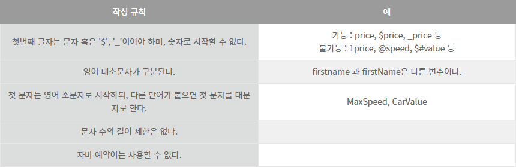

## 변수

#### 변수

하나의 값을 저장 할 수 있는 메모리 공간.


#### 변수 선언

어떤 타입의 데이터를 저장할지, 변수이름을 무엇으로 할지 결정한다.

자바의 경우 다음과 같은 변수 명명 규칙을 따른다.




#### 변수의 사용

변수는 다음과 같이 이름을 지정하고, 그 값을 초기화 시켜주어야 읽을 수 있다.

```java
int value = 30;					// 변수 value 선언 및 30으로 값 초기화
int result = value + 10;		// 변수 value 의 값을 읽고 10을 더한 결과값을 result에 저장
```


#### 이스케이프 문자

| 이스케이프 문자 |            용도            |   유니코드    |
| :-------------: | :------------------------: | :-----------: |
|      '\t'       |          수평 탭           |    0x0009     |
|      '\n'       |          줄 바꿈           |    0x000a     |
|      '\r'       |            리턴            |    0x000d     |
|      '\\"'      |        " (큰따옴표)        |    0x0022     |
|      '\\''      |       ' (작은따옴표)       |    0x0027     |
|     '\\\\'      |             \              |    0x005c     |
|   '\u16진수'    | 16진수에 해당하는 유니코드 | 0x0000~0xffff |

문자 리터럴을 저장하는 타입은 char 하나뿐이다.
