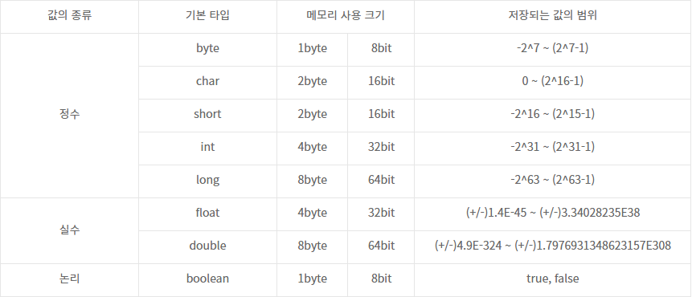
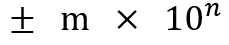
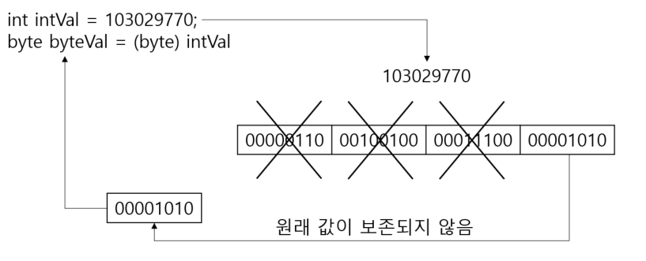

# 타입

#### 타입

모든 변수가 지니는 형태로, 저장할수 있는 값의 종류와 범위가 달라진다. 


#### 기본(primitive) 타입




메모리에는 0과 1을 저장하는 최소 기억 단위인 비트(bit)가 있다. 8개의 비트를 묶어 바이트(byte)라고 하며, 위의 테이블을 보면 알 수 있드시, 각 타입에 따라 크기와 저장되는 값의 범위가 다르다.


#### 정수 타입(byte, char, short, int, long)

정수 타입은 총 5개로 byte, char, short, int, long 이며, 대체로 기본적인 정수 연산은 int 로 한다. 


###### byte 타입

byte 타입은 대체로 색상 정보 및 이미지 등의 바이너리 데이터를 처리할 때 주로 사용되며, 가장 적은 범위의 수를 저장한다. 
1 byte(8 bit)의 데이터를 저장 가능하며, -128~127까지의 숫자를 표현 및 저장 가능하다.


###### char 타입

char 타입은 문자를 저장하는데 주로 쓰이는 변수로, 모든 문자를 유니코드(Unicode)로 처리한다.

```java
char c = 'c';			//Java 에서 문자를 저장하는 기본적인 방법
char c = 65;			//유니코드 정수값을 직접 입력
char c = '\u0041';		//유니코드 값을 직접 입력
```


###### short 타입

2 byte(16 bit)의 데이터를 저장 할 수 있는 정수 타입이자, C언어와의 호환을 위해 주로 사용되며, 저장할 수 있는 범위가 -32,768 ~ 32,767으로 다소 작다.


###### int 타입

4 byte(32 bit)의 데이터를 저장할 수 있는 정수 타입으로, -2,147,483,648 ~ 2,147,483,647까지의 숫자를 표현 가능해 자바에서 정수 연산을 하기 위한 기본 타입으로 사용된다.


###### long 타입

8 byte(64 bit)의 데이터를 저장 가능한 정수 타입으로, -9,223,372,036,854,775,808 ~ 9,223,372,036,854,775,807 까지의 숫자를 저장 가능하다. 숫자가 큰 데이터를 다루는 프로그램의 경우 주로 쓰이나(은행, 우주 관련 등),  이외의 경우 값이 너무 커 데이터를 많이 사용하기에 int가 기본값으로 쓰이게 된다.
※ long 타입을 초기화 할 경우, 정수값 뒤에 소문자 'l'혹은 대문자 'L'을 붙여, 4 byte가 아닌 8 byte의 정수 데이터임을 명시하기도 한다. 소문자 'l'의 경우, 숫자 '1'과 헷갈릴 수 있어 주로 대문자 "L"을 사용한다.

`````java
long var = 100000000000L;
long var2 = 20L;
`````


#### 유니코드

유니코드는 세계 각국의 문자들을 코드 값으로 매핑한 국제 표준 규약으로, 하나의 문자에 하나의 코드값을 부여한다. 0~65535범위의 2 byte 크기의 정수값 데이터까지는 아스키(ASCII) 문자(특수 기호 및 영어 알파벳)으로 할당되어 있고, 44032 ~ 55203까지 11172자에 한글이 할당되어 있다.

<a href="http://www.unicode.org">유니코드 문자표</a>에서 유니코드를 확인 가능하다.


#### 실수 타입(float, double)

실수 타입의 경우, float와 double은 각각 int 와 long과 같은 메모리 크기를 갖지만, 부동 소수점의 방식으로 저장되기에, 정수 타입보다 더 큰 범위의 값이 저장 가능하다.

| 실수 타입 | float | double |
| :-------: | :---: | :----: |
| 바이트 수 |   4   |   8    |

###### 부동 소수점(floating-point)

실수 타입은 아래와 같은 방식으로 갑을 저장하는데, 이를 부동 소수점 방식이라 한다. 각각 m은 가수(mantissa), n은 지수(exponent)라 부른다.(가수 m은 0과 1 사이의 실수여야 한다)



###### float

부호(1 bit) + 지수(8 bit) + 가수(23 bit) = 32 bit로 이루어져 있다.

<table style="width:50%">
    <th style="color:gray">1</th><th>지수(8 bit)</th><th>가수(23 bit)</th>
</table> 


###### double

double : 부호(1 bit) + 지수(11 bit) + 가수(52 bit) = 64 bit로 이루어져 있다.

<table style="width:75%">
    <th>1</th><th>지수 (11 bit)</th><th>가수 (52 bit)</th>
</table>


#### 논리 타입(boolean)

###### boolean

1byte(8 bit)로 표현되는 논리값(true/flase)를 저장할 수 있는 데이터 타입으로, 두 가지 상태값을 저장할 필요성이 있을때 사용되며, 상태값에 따라 조건문과 제어문의 실행 흐름 제어 등에 사용된다.


#### 타입 변환

###### 자동 타입 변환

크기가 작은 타입 -> 크기가 큰 타입으로 저장될 때 발생된다.

크기별로 타입을 정리하면 다음과 같으며, 해당 타입의 크기에 따라 자동 형 변환이 이뤄진다.

<div>
    byte(1) < short(2) < int(4) < long(8) < float(4) < double(8)
</div>


자동 형변환에는 예외사항이 하나 있는데, char 는 2byte 의 크기를 가지지만, 음수가 저장될 수 없기에, 음수가 저장될 수 있는 byte 타입은 char 타입으로 자동변환이 불가능하다.

````java
byte byteValue = 65;
char charValue = byteValue;			//(x)
char charData = (char) byteData;	//(O)강제 타입 변환
````


###### 강제 타입 변환(casting)

크기가 더 큰 타입은 자동 타입 변환이 불가능하여, 강제적으로 타입 변환을 해주어야 하는데, 이때 크기가 큰 타입을 작은 타입으로 다 집어넣을 수 없기 때문에, 타입을 쪼개서 가장 끝에 있는 byte만 저장하는 방법이 가능하다.

````java
int intVal = 103029770;
byte byteVal = byte intVal;
````

강제 형 변환시는 다음과 같이 원래 값이 보존되지 않고, 표현 가능한 범주 내에서 끝부분만 강제로 형 변환이 된다. 



