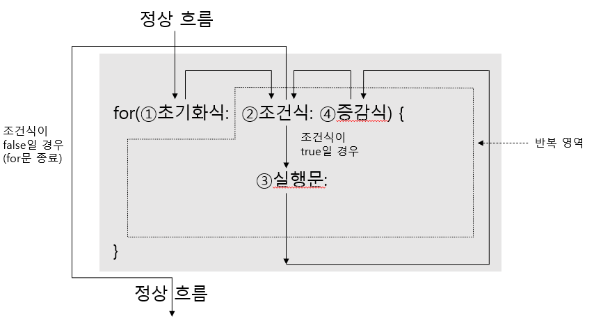
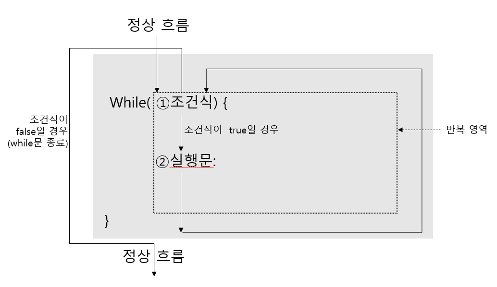
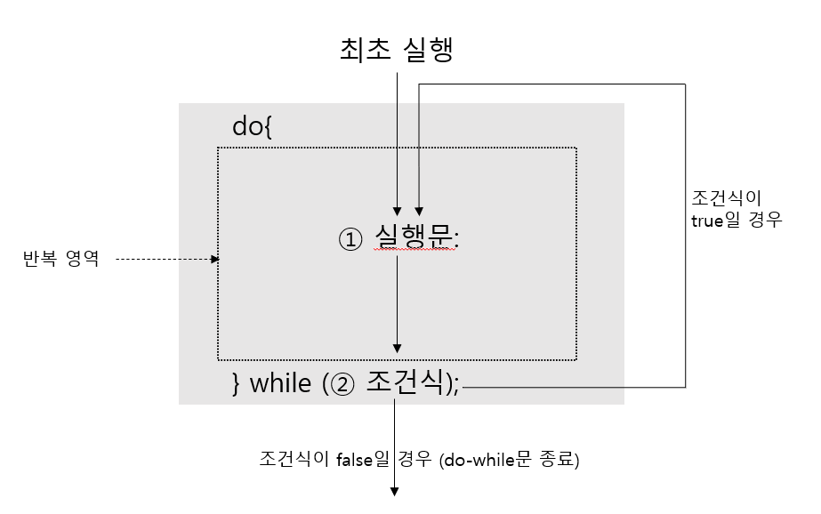
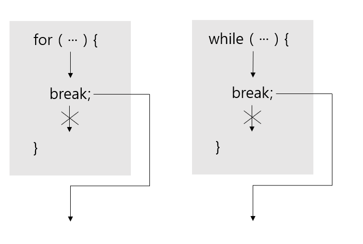
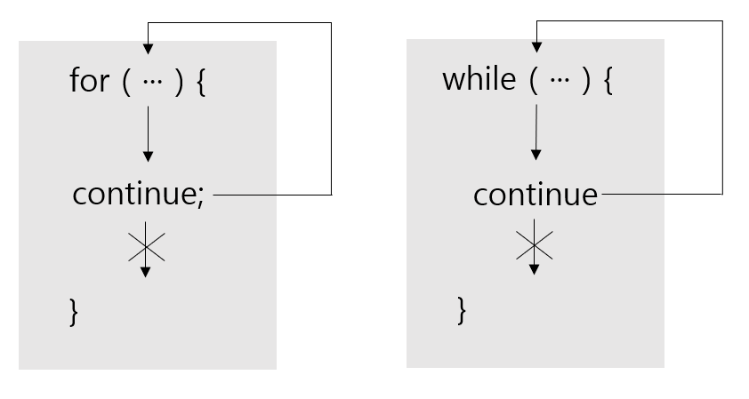

# 반복문

#### 반복문(for 문, while 문, do-while 문)

어떤 작업을 반복적으로 실행되게 할 때 사용하는 제어문.


###### for 문

주로 반복 횟수를 알고 있을 때 사용한다.
정해진 횟수만큼 반복.



초기화식 : 조건식과 실행문, 증감식에서 사용할 변수를 초기화하는 역할을 한다.

````java
for(int i=1; i<=100; i++)
````

※ 초기화식에서 루프 카운트 변수 선언시에는 부동소수점 타입을 사용하면 안된다.


###### while 문

조건에 따라 반복할 때 주로 사용. 조건을 먼저 검사한다. 
조건이 true일 경우 계속해서 반복하기에, 조건식에 비교 혹은 논리 연산식이 주로 온다.



조건식에 boolean 혹은 true/false 값을 산출하는 연산식이 올 수 있기에, 조건식에 true를 집어넣으면 무한루프를 돌게 된다.


###### do-while 문

조건식에 의해 반복 실행한다는 점은 while문과 동일하나, while문은 시작할때 조건식을 검사하는 반면, do-while문은 일단 블록 내부를 실행시키고, 실행 결과에 따라 반복을 진행할지 여부를 결정한다는 차이점이 있다.




###### break 문

반복문인 for문, while문, do-while문과 조건문인 switch 문을 실행 중지할때 쓰인다.



반복문이 중첩된 경우, break문은 가장 가까운 반복문을 종료시키나, 라벨을 붙여 바깥쪽 반복문을 종료시키는게 가능하다.

````java
Outter: for(char upper='A'; upper<='Z'; upper++){
	for(char lower='a'; lower<='z'; lower++){
		System.out.println(upper + "-" + lower);
		if(lower=='g'){
			break Outter;
		}
	}
}
````


###### continue 문

반복문인 for문, while문, do-while문에서만 사용되며, for문의 증감식이나 while, do-while의 조건식으로 이동한다.
continue문은 break문과 달리 반복문을 종료시키지 않고 계속 반복을 수행한다는 차이점이 존재한다.



다음과 같은 경우에 사용된다.

````java
for(int i=1; i<=10; i++){
	if(i%2 != 0){
		continue;
	}
}
````


###### 키보드 키 코드

<table>
    <tr>
    	<th>숫자</th>
        <th colspan="4">알파벳</th>
        <th>기능 키</th>
        <th> 방향키</th>
    </tr>
    <tr>
    	<td>0=48<br>1=49<br>2=50<br>3=51<br>4=52<br>5=53<br>6=54<br>7=55<br>8=56<br>9=57</td>
        <td>A=65<br>B=66<br>C=67<br>D=68<br>E=69<br>F=70<br>G=71<br>H=72<br>I=73<br>J=74<br>K=75<br>L=76<br>M=77</td>
        <td>N=78<br>O=79<br>P=80<br>Q=81<br>R=82<br>S=83<br>T=84<br>U=85<br>V=86<br>W=87<br>X=88<br>Y=89<br>Z=90</td>
        <td>a=97<br>b=98<br>c=99<br>d=100<br>e=101<br>f=102<br>g=103<br>h=104<br>i=105<br>j=106<br>k=107<br>l=108<br>m=109</td>
        <td>n=110<br>o=111<br>p=112<br>q=113<br>r=114<br>s=115<br>t=116<br>u=117<br>v=118<br>w=119<br>x=120<br>y=121<br>z=122</td>
        <td>Backspace=8<br>Tab=9<br>Enter=[CR=13,LF=10]<br>Shift=16<br>Ctrl=17<br>Alt=18<br>ESC=27<br>Space=32<br>PAGEUP=33<br>PAGEDN=34</td>
        <td>← = 37<br>↑ = 38<br>→ = 39<br>↓ = 40</td>
    </tr>
</table>


