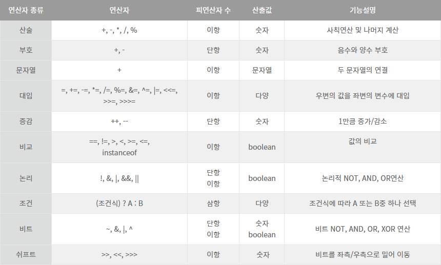
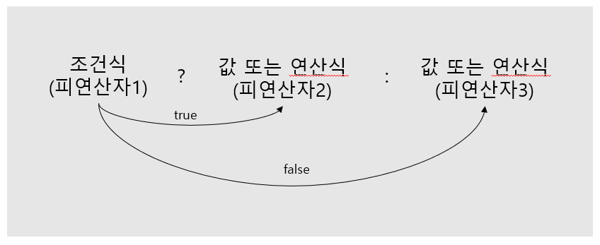

# 연산자

#### 연산

###### 연산

프로그램에서 데이터를 처리하여 결과를 산출하는 과정. 


###### 연산자

연산시에 사용되는 표시 및 기호


###### 피연산자

연산되는 데이터


###### 연산식

연산자, 피연산자를 이용해 연산의 과정을 기술한 것.





#### 연산자의 종류

##### 단항 연산자

###### 부호 연산자(+, -)

양수 및 음수를 표시하는 +, -타입을 말하며, boolean과 char타입을 제외한 나머지 기본 타입에 사용 가능하다.
산술연산자로도 쓰이며, 부호 연산자로 쓰일 때는 하나의 피연산자만을 필요로 한다.

<table style="width: 60%; margin-right:auto; margin-left:auto; text-align:center; border:1">
    <tr><th colspan="2">연산식</th><th>설명</th></tr>
    <tr><td style="width:25%">+</td><td style="width:25%">피연산자</td><td>피연산자의 부호 유지</td></tr>
    <tr><td style="width:25%">-</td><td style="width:25%">피연산자</td><td>피연산자의 부호 변경</td></tr>
</table>

※부호 연산자를 사용할 시, 산출 타입은 int로 자동 형변환이 된다.


###### 증감 연산자(++,--)

변수의 값을 1 증가(++)시키거나, 1감소(--)시키는 연산자를 말하며, boolean타입을 제외한 모든 기본 타입의 피연산자에 사용 가능하다.

<table style="width: 80%; margin-right:auto; margin-left:auto; text-align:center">
    <tr><th colspan="2">연산식</th><th>설명</th></tr>
    <tr><td style="width:20%">++</td><td style="width:20%">피연산자</td><td>다른 연산을 수행하기 전에 피연산자 값을 1 증가시킴</td></tr>
    <tr><td style="width:20%">--</td><td style="width:20%">피연산자</td><td>다른 연산을 수행하기 전에 피연산자 값을 1 감소시킴</td></tr>
    <tr><td style="width:20%">피연산자</td><td style="width:20%">++</td><td>다른 연산을 수행한 후에 피연산자 값을 1 증가시킴</td></tr>
    <tr><td style="width:20%">피연산자</td><td style="width:20%">--</td><td>다른 연산을 수행한 후에 피연산자 값을 1 감소시킴</td></tr>
</table

모두 계산은 동일하나, 순서의 차이가 존재한다.

````java
++i;	/*i=i+1*/					--i;		//i=i-1
i++;	/*i=i+1*/					i--;		//i=i-1
````


###### 논리 부정 연산자(!)

true를 false로, false를 true로 변경하기에, boolean 타입에만 사용 가능하다.

<table style="width: 70%; margin-right:auto; margin-left:auto; text-align:center; border:1">
    <tr><th colspan="2">연산식</th><th>설명</th></tr>
    <tr><td style="width:20%">!</td><td style="width:20%">피연산자</td><td>피연산자가 true면 false 값을 산출<br>피연산자가 false이면 true 값을 산출</td></tr>
</table>

주로 조건문과 제어문에서 사용되며, 값을 부정하여 실행 흐름을 제어할때 사용된다.


###### 비트 반전 연산자

정수타입(byte, short, int, long)의 피연산자에만 사용되며, 피연산자를 2진수로 표현할때 비트값인 0은 1로, 1은 0으로 반전시킨다.
연산 후, 부호 비트인 최상위 비트를 포함한 모든 비트가 반전되기에, 부호가 반대인 새로운 값이 산출된다.

<table style="text-align:center; width:70%; margin-left:auto; margin-right:auto">
    <tr><th colspan="2">연산식</th><th>설명</th></tr>
    <tr><td style="width:10%">~</td><td>숫자:10
        <table style="width:10%; margin-left:auto; margin-right:auto">
        <td>0</td><th>0</th><th>1</th><th>0</th><th>1</th><th>0</th>
        </table></td><td>산출 결과:-21<table style="width:10%; margin-left:auto; margin-right:auto">
        <td>1</td><th>1</th><th>0</th><th>1</th><th>0</th><th>1</th>
        </table></td></tr>
</table>

※비트 반전 연산자 또한 산출 타입이 int로 형변환된다.


##### 이항 연산자

###### 산술 연산자(+, -, *, /, %)

각각 더하기(+), 빼기(-), 곱하기(*), 나누기(/)와 나머지를 구하는 연산자(%)를 포함해 산술 연산자는 총 5개이다.
boolean 타입을 제외한 모든 기본 타입에 사용 가능하다.

<table>
    <tr><th colspan="3">연산식</th><th>설명</th></tr>
    <tr><td>피연산자</td><td>+</td><td>피연산자</td><td>덧셈 연산</td></tr>
    <tr><td>피연산자</td><td>-</td><td>피연산자</td><td>뺄셈 연산</td></tr>
    <tr><td>피연산자</td><td>*</td><td>피연산자</td><td>곱셈 연산</td></tr>
    <tr><td>피연산자</td><td>/</td><td>피연산자</td><td>좌측 피연산자를 우측 피연산자로 나눗셈 연산</td></tr>
    <tr><td>피연산자</td><td>%</td><td>피연산자</td><td>좌측 피연산자를 우측 피연산자로 나눈 나머지를 구하는 연산</td></tr>
</table>

※ long 타입을 제외한 정수 타입은 int 타입으로 산출되며, 피연산자중 하나라도 실수이면 실수타입으로 산출된다.


###### 문자열 연결 연산자(+)

문자열을 서로 결합하는 연산자로, 피연산자 중 한쪽이 문자열이면 문자열 연결 연산자로 사용되며 다른 피연산자를 문자열로 변환하고 서로 결합한다.

``````java
String str1 = "JDK" + 6.0;				 // JDK6.0
String str2 = str1 + " 특징";				// JDK6.0 특징
``````

※문자열과 숫자가 혼합된 연산식의 경우, 왼쪽에서부터 오른쪽으로 연산하며, 숫자 피연산자가 2개 이상일 경우, 문자열 연결이 아닌 합 연산이 될 수 있음에 주의해야한다.

``````
3+3.0+"JDK";			//6.0JDK
``````


###### 비교 연산자(<, <=, >=, ==, !=)

대소(<, <=, >, >=) 또는 동등(==, !=)을 비교해 boolean 타입인 true/false를 산출한다. 
대소 연산자는 boolean 타입을 제외한 기본 타입에 사용 가능하며, 동등 연산자는 모든 기본 타입에 사용 가능하다.

<table>
    <tr><th>구분</th><th colspan="3">연산식</th><th>설명</th></tr>
    <tr><td rowspan="2">동등 비교</td><td>피연산자1</td><td>==</td><td>피연산자2</td><td>두 피연산자의 값이 같은지를 검사</td></tr>
    <tr><td>피연산자1</td><td>!=</td><td>피연산자2</td><td>두 피연산자의 값이 다른지를 검사</td></tr>
    <tr><td rowspan="4">크기 비교</td><td>피연산자1</td><td>></td><td>피연산자2</td><td>피연산자1이 큰지를 검사/td></tr>
    <tr><td>피연산자1</td><td>>=</td><td>피연산자2</td><td>피연산자1이 크거나 같은지를 검사</td></tr>
    <tr><td>피연산자1</td><td><</td><td>피연산자2</td><td>피연산자1이 작은지를 검사</td></tr>
    <tr><td>피연산자1</td><td><=</td><td>피연산자2</td><td>피연산자 1이 작거나 같은지를 검사</td></tr>
</table>

※연산 수행시 int 타입 혹은 double 타입으로 변환 후 비교하나, 2진 포맷의 부동소수점 타입은 0.1을 정확히 표현이 불가능하기에, 피연산자를 float 타입으로 강제 타입변환하거나, 정수로 변환해서 비교해야한다.

````java
String str1 = "천웅재";
String str2 = "천웅재";
String str3 = new String("천웅재");
````

String 타입의 경우, 대소 연산자는 사용 불가하며, 동등 비교 연산자는 사용 가능하나, 문자열이 같은지 다른지를 비교하는 용도로는 사용되지 않는다.

자바는 문자열 리터럴이 동일하면 동일 String 객체를 참조하는데, str3은 객체 생성 연산자인 new를 통해 새로운 String 객체의 번지값을 참조하여, 아래와 같은 결과가 나온다.

````java
str1 == str2;		// true
str2 == str3;		// false
````

따라서 String 객체의 문자열만을 비교하고자 하면 ==연산자 대신 equals() 메소드를 사용해야한다.


###### 논리 연산자(&&, ||, &, |, ^, !)

논리곱(&&), 논리합(||), 배타적 논리합(^), 논리부정(!) 연산을 수행하며, 피연산자는 boolean 타입만 사용가능하다

<table>
    <tr><th>구분</th><th colspan="3">연산식</th><th>결과</th><th>설명</th></tr>
    <tr><td rowspan="4">AND(논리곱)</td><td>true</td><td rowspan="4">&& 또는 &</td><td>true</td><td>true</td><td rowspan="4">피연산자 모두가 true일 경우에만 연산 결과가 true</td></tr>
    <tr><td>true</td><td>false</td><td>false</td></tr>
    <tr><td>false</td><td>true</td><td>false</td></tr>
    <tr><td>false</td><td>false</td><td>false</td></tr>
    <tr><td rowspan="4">OR(논리합)</td><td>true</td><td rowspan="4">|| 또는 |</td><td>true</td><td>true</td><td rowspan="4">피연산자 중 하나만 true면 연산 결과는 true</td></tr>
    <tr><td>true</td><td>false</td><td>true</td></tr>
    <tr><td>false</td><td>true</td><td>true</td></tr>
    <tr><td>false</td><td>false</td><td>false</td></tr>
    <tr><td rowspan="4">XOR(배타적논리합)</td><td>true</td><td rowspan="4">^</td><td>true</td><td>false</td><td rowspan="4">피연산자가 하나는 true이고 다른 하나가 false일 경우에만 연산 결과는 true</td></tr>
    <tr><td>true</td><td>false</td><td>true</td></tr>
    <tr><td>false</td><td>true</td><td>true</td></tr>
    <tr><td>false</td><td>false</td><td>false</td></tr>
    <tr><td rowspan="2">NOT(논리부정)</td><td rowspan="2"></td><td rowspan="2">!</td><td>true</td><td>false</td><td rowspan="2">피연산자의 논리값을 바꿈</td></tr>
    <tr><td>false</td><td>true</td></tr>
</table>

&&와 &, ||와 | 은 둘다 산출 결과는 같으나 연산 과정이 좀 다른데, &&의 경우 앞의 피연산자가 false면 뒤의 피연산자를 평가하지 않고 false라는 산출 결과를 낸다. 따라서 &&가 더 효율적으로 동작한다
||와 |의 경우 ||은 앞의 피연산자가 true면 뒤의 피연산자를 평가하지 않고 true를 산출하고, |은 두 피연산자 모두를 평가해 산출하기에, ||이 |보다 더 효율적으로 동작한다.


###### 비트 논리 연산자(&, |, ~,)

데이터를 비트(bit)단위로 연산하며, 0과 1이 피연산자로 쓰인다. 따라서 정수 타입만 비트 연산이 가능하다.

<table>
    <tr><th>구분</th><th colspan="3">연산식</th><th>결과</th><th>설명</th></tr>
    <tr><td rowspan="4">AND(논리곱)</td><td>1</td><td rowspan="4">&</td><td>1</td><td>1</td><td rowspan="4">두 비트 모두 1일 경우에만 연산 결과가 1</td></tr>
    <tr><td>1</td><td>0</td><td>0</td></tr>
    <tr><td>0</td><td>1</td><td>0</td></tr>
    <tr><td>0</td><td>0</td><td>0</td></tr>
    <tr><td rowspan="4">OR(논리합)</td><td>1</td><td rowspan="4">|</td><td>1</td><td>1</td><td rowspan="4">두 비트 중 하나만 1이어도 연산 결과가 1</td></tr>
    <tr><td>1</td><td>0</td><td>1</td></tr>
    <tr><td>0</td><td>1</td><td>1</td></tr>
    <tr><td>0</td><td>0</td><td>0</td></tr>
    <tr><td rowspan="4">XOR(배타적 논리합)</td><td>1</td><td rowspan="4">^</td><td>1</td><td>0</td><td rowspan="4">두 비트 중 하나는 1이고 다른 하나가 0일 경우 연산 결과는 1</td></tr>
    <tr><td>1</td><td>0</td><td>1</td></tr>
    <tr><td>0</td><td>1</td><td>1</td></tr>
    <tr><td>0</td><td>0</td><td>0</td></tr>
    <tr><td rowspan="2">NOT(논리 부정)</td><td></td><td rowspan="2">~</td><td>1</td><td>0</td><td rowspan="2">보수</td></tr>
    <tr><td></td><td>0</td><td>1</td></tr>
</table>

※ 비트 연산자는 피연산자를 int 타입으로 자동 타입 변환 한 후 연산을 수행한다.


###### 비트 이동 연산자( <<, >>, >>> )

데이터를 비트(bit)단위로 연산하며, 0과 1이 피연산자로 쓰인다. 따라서 정수 타입만 비트 연산이 가능하다.

<table>
    <tr><th>구분</th><th colspan="3">연산식</th><th>설명</th></tr>
    <tr><td rowspan="3">이동(쉬프트)</td><td>a</td><td><<</td><td>b</td><td>정수 a의 각 비트를 b만큼 왼쪽으로 이동(빈자리는 0으로 채워짐)</td></tr>
    <tr><td>b</td><td>>></td><td>b</td><td>정수 a의 각 비트를 b만큼 오른쪽으로 이동(빈자리는 정수 a의 최상위 부호 비트(MSB)와 같은 값으로 채워짐</td</tr>
        <tr><td>a</td><td>>>></td><td>b</td><td>정수 a의 각 비트를 b만큼 오른쪽으로 이동(빈자리는 0으로 채워짐)</td></tr>
</table>


###### 대입 연산자(=, +=, -=, *=, /=, %=, &=, ^=, <<=, >>=, >>>=)

오른쪽 피연산자의 값을 좌측 피연산자의 변수에 저장한다. 오른쪽 피연산자는 리터럴 및 변수, 그리고 다른 연산식이 올 수 있다.

<table>
    <tr><th>구분</th><th colspan="3">연산식</th><th>설명</th></tr>
    <tr><td>단순 대입 연산자</td><td>변수</td><td>=</td><td>피연산자</td><td>우측의 피연산자 값을 변수에 저장</td></tr>
    <tr><td rowspan="11">복합 대입 연산자</td><td>변수</td><td>+=</td><td>피연산자</td><td>우측의 피연산자의 값을 변수의 값과 더한 후에 다시 변수에 저장(변수 = 변수 + 피연산자)</td></tr>
    <tr><td>변수</td><td>-=</td><td>피연산자</td><td>우측의 피연산자의 값을 변수의 값에서 뺀 후에 다시 변수에 저장(변수 = 변수 - 피연산자)</td></tr>
    <tr><td>변수</td><td>*=</td><td>피연산자</td><td>우측의 피연산자의 값을 변수의 값과 곱한 후에 다시 변수에 저장(변수 = 변수 * 피연산자)</td></tr>
    <tr><td>변수</td><td>/=</td><td>피연산자</td><td>우측의 피연산자의 값을 변수의 값으로 나눈 후에 몫을 다시 변수에 저장(변수 = 변수 / 피연산자)</td></tr>
    <tr><td>변수</td><td>%=</td><td>피연산자</td><td>우측의 피연산자의 값을 변수의 값으로 나눈 후에 나머지를 후에 다시 변수에 저장(변수 = 변수 % 피연산자)</td></tr>
    <tr><td>변수</td><td>&=</td><td>피연산자</td><td>우측의 피연산자의 값과 변수의 값을 & 연산 후 결과를 다시 변수에 저장(변수 = 변수 & 피연산자)</td></tr>
    <tr><td>변수</td><td>|=</td><td>피연산자</td><td>우측의 피연산자의 값과 변수의 값을 | 연산 후 결과를 다시 변수에 저장(변수 = 변수 | 피연산자)</td></tr>
    <tr><td>변수</td><td>^=</td><td>피연산자</td><td>우측의 피연산자의 값과 변수의 값을 ^ 연산 후 결과를 다시 변수에 저장(변수 = 변수 ^ 피연산자)</td></tr>
    <tr><td>변수</td><td><<=</td><td>피연산자</td><td>우측의 피연산자의 값과 변수의 값을 << 연산 후 결과를 다시 변수에 저장(변수 = 변수 << 피연산자)</td></tr>
    <tr><td>변수</td><td>>>=</td><td>피연산자</td><td>우측의 피연산자의 값과 변수의 값을 >> 연산 후 결과를 다시 변수에 저장(변수 = 변수 >> 피연산자)</td></tr>
    <tr><td>변수</td><td>>>>=</td><td>피연산자</td><td>우측의 피연산자의 값과 변수의 값을 >>> 연산 후 결과를 다시 변수에 저장(변수 = 변수 >>> 피연산자)</td></tr>
</table>


##### 삼항 연산자

세 개의 피연산자를 필요로 하는 연산자를 말한다. ? 앞의 조건식에 따라 콜론(:) 앞뒤의 피연산자가 선택된다고 해서 조건 연산식이라고도 불린다



조건식을 연산해 true가 나오면 삼항 연산자의 결과는 피연산자2가 되며, false가 나오면 삼항 연산자의 결과는 피연산자3이 된다.
