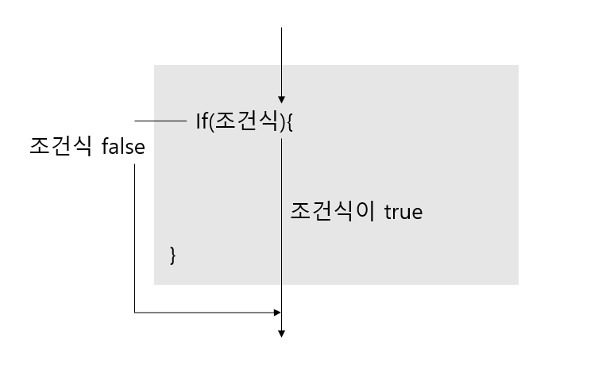
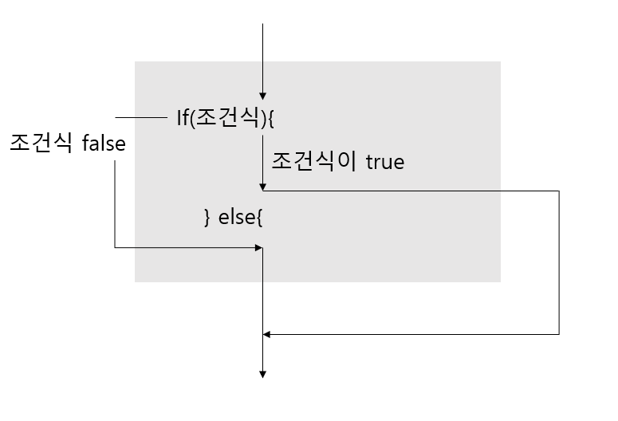
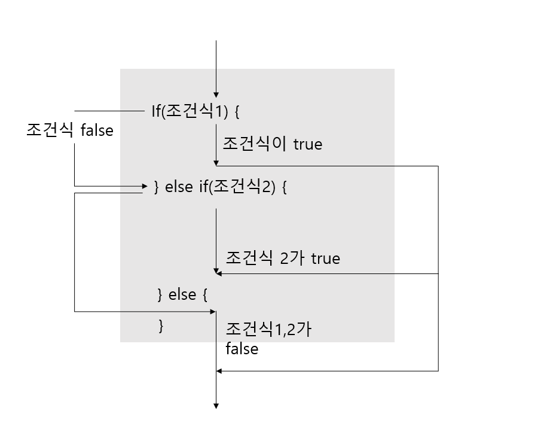
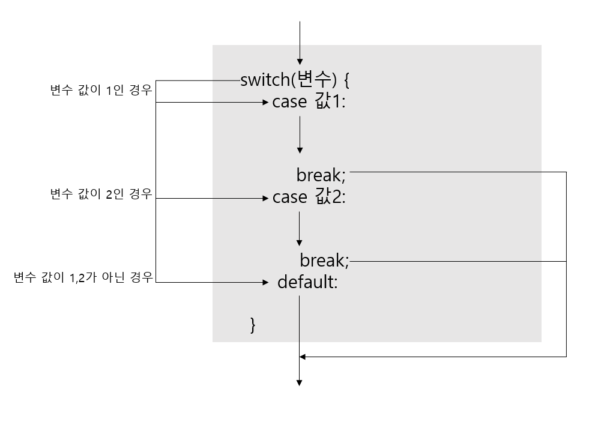

# 조건문

#### 코드 실행 흐름 제어

간단히 제어문이라고 하며, 조건식과 중괄호 블록으로 구성, 조건식의 연산 결과에 따라 블록 내부의 실행 여부가 결정된다.


#### 조건문(if 문, switch 문)

조건식의 결과에 따라 블록 실행 여부를 결정하는 제어문.


###### if 문

조건식에는 true or false 값을 산출할 수 있는 연산식이나 boolean 변수가 올 수 있다.

if의 조건식이 true일때 블록 내부를 실행하고, false일때는 블록을 실행하지 않는다.




###### if-else 문

if의 조건식이 true일때 if문의 블록이 실행되고, false일때는 else 블록이 실행되는 조건식이다. 



###### if-else if-else 문

처음 if문이 false일 경우 다른 조건식의 결과에 따라 실행 블록을 선택하는 조건문. 여러개의 조건식 중  true가 되는 블록 하나만 실행하고, if문을 벗어난다. 
마지막에 else를 추가하여 모든 조건식이 false일때 else문을 실행하고 조건문을 벗어나게 할 수 있다.



###### 중첩 if문

if문 안에 또 다른 if문을 사용 가능하며, 이를 중첩 if문이라고 할 수 있다. if문, switch문, for문, while문, do while문은 서로 중첩이 가능하다.


###### switch 문

true/false로 조건을 제어하는 if문과 달리, 변수의 값에 따라 실행문을 결정하며, 같은 기능을 하는 if-else if 문보다 코드가 간결하다.



아래와 같이 사용하며, case로 구분하며, break를 통해 다음 case를 실행하지 말고 switch문을 빠져나가게끔 한다. 또한, case의 끝에는 ;(세미콜론)이 아닌 :(콜론)을 사용한다.

````java
switch(num){
    case 1:
        System.out.println("1번이 나왔습니다.");
        break;
    case 2:
        System.out.println("2번이 나왔습니다.");
        break;
    case 3:
        System.out.println("3번이 나왔습니다.");
    	break;
}
````


